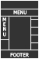

Documentation 
=======================

Introduction
------------

- Que fait cette extension ?

Cette extension fournit, un gabarit supplémentaire personnalisé dans TYPO3 CMS. Elle permet d'avoir une structure de site, sous une forme
bien spécifique.

   
L'image ci-dessus affiche l'apparence du gabarit dans le CMS.

Manuel d'utilisation
---------------------

Après avoir importer l'extension depuis le module EXTENSION de TYPO3 CMS, il suffit d'inclure l'extension dans la page racine de votre
site.

- Les étapes d'installation :
  
Si ce n'est pas déjà fait, vous devez ajoutez un nouvel enregistrement de type "Enregistrements système" -> Gabarit. 
Comme ci-dessous.

  .. figure:: ../Images/gabarit_inc.png
      :alt: Étape de création de gabarit

Puis finalement, l'inclure dans le fichier crée précédement. Voici une image d'aide.

  .. figure:: ../Images/Inclusion.png
    :alt: Inclure une extension.

Et évidement faire appel au gabarit pour vos pages, afin d'avoir la struture attendue.

Configuration
-------------

  
