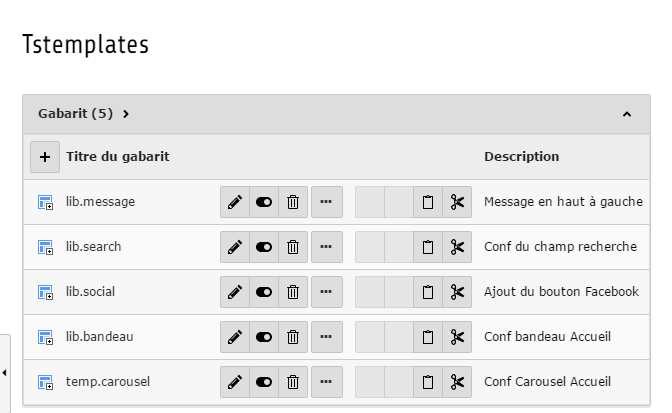

Documentation 
=======================

Introduction
------------

- Que fait cette extension ?

Cette extension fournit, un gabarit supplémentaire personnalisé dans TYPO3 CMS. Elle permet d'avoir une structure de site, sous une forme
bien spécifique.

.. figure:: ../Images/serignac.gif
   :width: 261px
   :alt: Image du gabarit
   
L'image ci-dessus représente l'apparence du gabarit dans le CMS.

Manuel d'utilisation
---------------------

Après avoir importer l'extension depuis le module EXTENSION de TYPO3 CMS, il suffit d'inclure l'extension dans la page racine de votre
site.

- Les étapes d'installation :
  
Si ce n'est pas déjà fait, vous devez ajoutez un nouvel enregistrement de type "Enregistrements système" -> Gabarit. 
Comme ci-dessous.

  .. figure:: ../Images/gabarit_inc.png
      :alt: Étape de création de gabarit

Puis finalement, l'inclure dans le fichier crée précédement. Voici une image d'aide.

  .. figure:: ../Images/Inclusion.png
    :alt: Inclure une extension.

Et évidement faire appel au gabarit pour vos pages, afin d'avoir la struture attendue.
(sélectionner le module PAGE puis cliquer sur l'icon pour "Modifier les propriétés de la page" ensuite cliquer sur l'onglet apparence
et choisir le gabarit t3_Sérignac) 

Configuration
-------------

Cette extension permet également à des fins de praticité, de regrouper toutes vos "librairies" (lib.xxxx) qui se serraient trouvées
normalement dans le sous-dossier Tstemplates de votre site. 

    
En effet, désormais il vous suffit de transférer vos lib dans le fichier setup.txt de l'extension qui se
trouve au chemin suivant, t3_Serignac/Configuration/TypoScript/setup.txt.

Si des modifications sont à faire au niveau du contenu de ces lib, le fichier constants.txt qui se trouve au chemin suivant,
t3_Serignac/Configuration/TypoScript/constants.txt, contient des variables qui peuvent être modifiées en fonction des besoins.

Pour ce qui est de l'appel des lib. avec le fluid <f:cObject typoscriptObjectPath="lib.xxxxx">, pas de changements. Si ce n'est qu'il
faille y faire appel dans le fichier de l'extension (t3_Serignac/Resources/Private/Layouts/Page/Default.html).

Erreurs connues et fréquentes
-----------------

Oubli ou erreurs d'inclusion des fichiers qui ont été crées dans l'extension.
Erreurs de nommage pour les chemins personnalisés 
